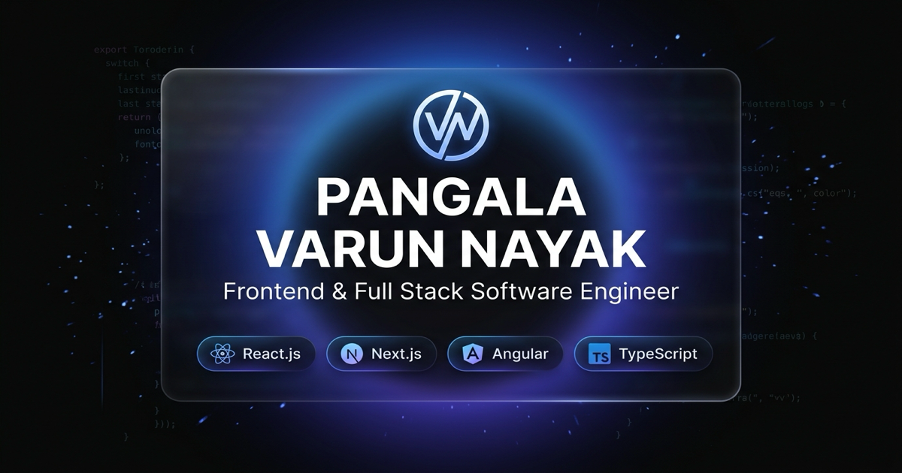
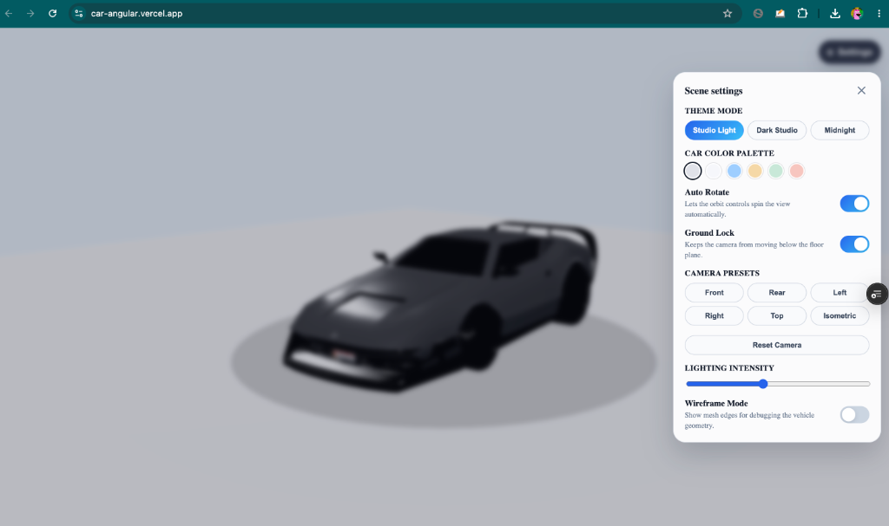
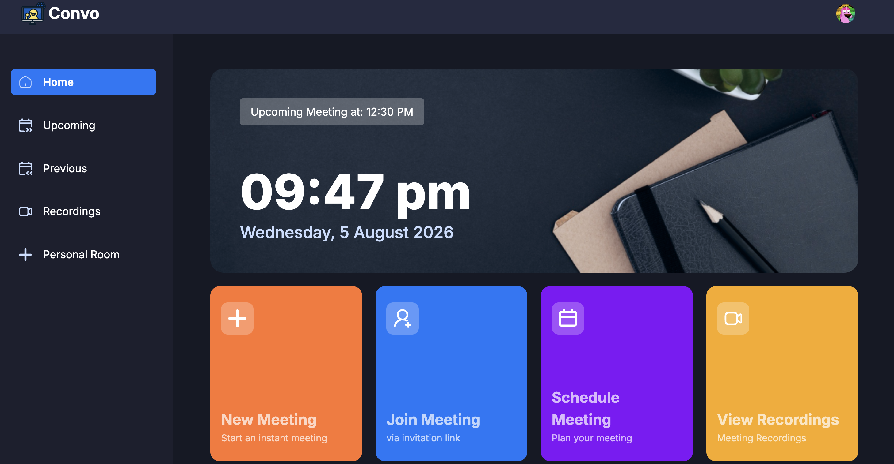
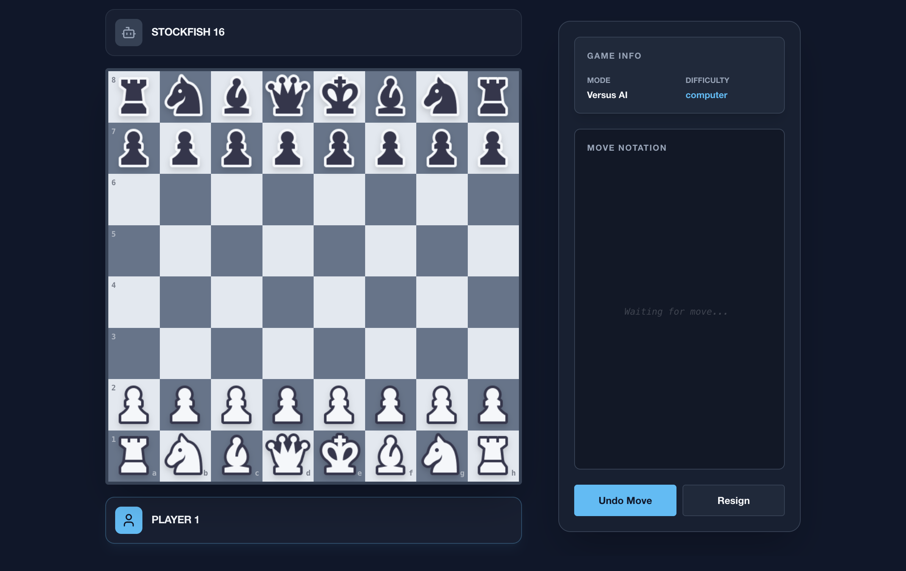
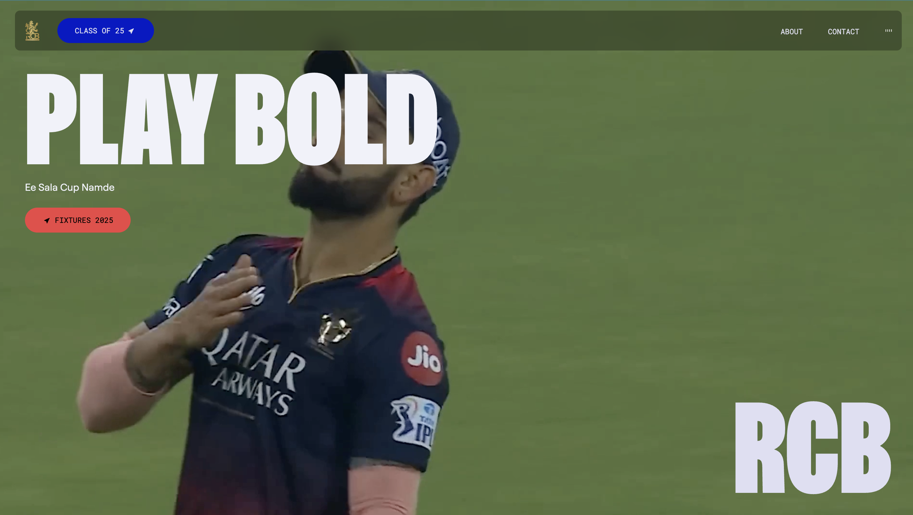
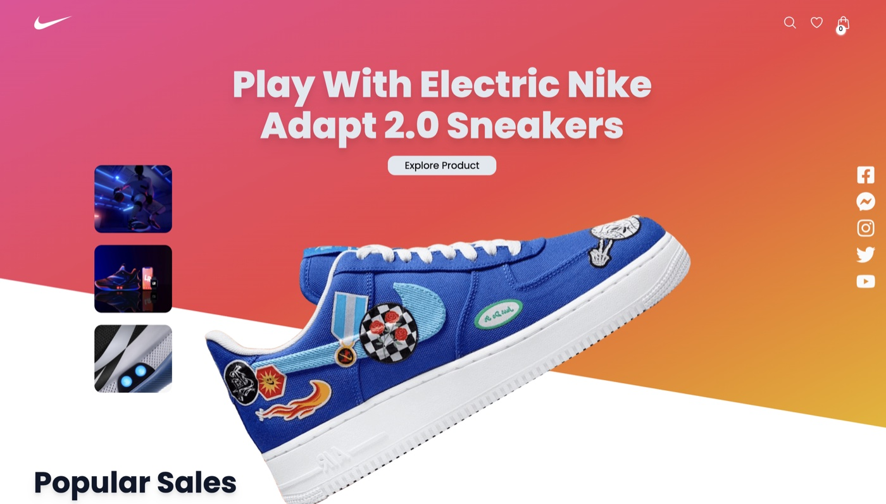

# 🚀 Varun Nayak — Senior Software Engineer Portfolio

[](https://varunnayak.in)
[](https://nextjs.org/)
[](https://react.dev/)
[](https://www.typescriptlang.org/)
[](https://threejs.org/)
[](LICENSE)

A state-of-the-art, high-performance developer portfolio built with **Next.js 16 (App Router)**, **React 19**, **Three.js / WebGL**, **Framer Motion**, and **Tailwind CSS**.

Designed and engineered by **Varun Nayak**, Senior Software Engineer specializing in Autonomous Systems, Software-Defined Vehicles (SDVs), WebGL/3D Graphics, and High-Scale Full-Stack Architecture.

---

## 📸 Portfolio Snapshots & Key Highlights



### 1. 🏎️ Interactive 3D WebGL Studio & Laboratory
Experience interactive 3D WebGL graphics powered by **Three.js** and **React Three Fiber**. Features an interactive 3D Car Configurator with real-time lighting adjustment, color customization, wireframe toggling, and camera angle presets.



---

### 2. 💼 Professional Engineering Timeline
Interactive career experience cards showcasing impactful engineering milestones at top-tier research and automotive institutions:
- **IISc (Indian Institute of Science)**: Autonomous vehicle perception and multi-modal edge sensor fusion research.
- **Mercedes-Benz R&D India**: Software-Defined Vehicle (SDV) cockpit systems and real-time infotainment architectures.
- **Bosch**: Embedded automotive diagnostic protocols and connected mobility backends.


---

### 3. 🛠️ Featured Engineering Projects

| Project | Showcase | Description |
| :--- | :---: | :--- |
| **Convo AI Voice Assistant** |  | Real-time AI voice meeting assistant with automated transcripts, calendar integration, and AI summaries. |
| **Shah-Mat 3D Chess** |  | Real-time multiplayer 3D chess game powered by WebSockets, Three.js WebGL graphics, and move analysis. |
| **RCB 2025 Fan Experience** |  | High-traffic sports franchise web app featuring dynamic Bento grids, live match scores, and fan interactions. |
| **Nike Store E-Commerce** |  | Modern e-commerce web application with interactive product customization, smooth animations, and cart management. |

---

## 🛠️ Tech Stack & Engineering Standards

### Core Web Technologies
- **Framework**: Next.js 16 (Turbopack, App Router, React Server Components)
- **Language**: TypeScript 5.0 (Strict mode)
- **Styling**: Vanilla CSS Modules & Tailwind CSS (Custom Dark Studio Design Tokens)
- **3D Graphics & Canvas**: Three.js, `@react-three/fiber`, `@react-three/drei`
- **Animations**: Framer Motion, Lenis Smooth Scroll
- **Icons & Typography**: Lucide React, Google Outfit & JetBrains Mono Fonts

### Production Security & SEO
- **Canonical Routing**: Permanent 308 redirects (`www.varunnayak.in` → `varunnayak.in`)
- **Security Headers**: Content-Security-Policy (CSP), HSTS (63,072,000s), X-Frame-Options (DENY), X-Content-Type-Options (nosniff), Referrer-Policy
- **SEO & Metadata**: JSON-LD Structured Data (`Person` & `WebSite`), OpenGraph 1200x630 social images, Dynamic XML Sitemap, `robots.txt`
- **Accessibility**: WCAG 2.1 AA compliant keyboard navigation, ARIA semantics, focus traps, and reduced-motion detection

---

## 📁 Repository Structure

```
portfolio-26/
├── app/                        # Next.js 16 App Router pages & layouts
│   ├── layout.tsx              # Root layout with fonts, smooth scroll & JSON-LD
│   ├── page.tsx                # Main server-rendered homepage
│   ├── sitemap.ts              # Dynamic XML sitemap generator
│   └── robots.ts               # Robots.txt configuration
├── components/                 # Reusable UI components & modals
│   ├── ui/                     # Command Menu, Header, Footer, Modals
│   └── icons/                  # SVG Icon components
├── features/                   # Domain-driven feature modules
│   ├── hero/                   # Hero section with ambient WebGL canvas
│   ├── experience/             # Career timeline & interactive accordions
│   ├── projects/               # Filterable projects showcase grid
│   ├── playground/             # Interactive 3D WebGL laboratory demos
│   ├── articles/               # Deep-dive engineering publications
│   └── contact/                # Contact section with interactive modal
├── public/                     # Static assets, 3D GLTF models, and images
│   ├── models/                 # 3D GLB/GLTF assets
│   ├── projects/               # High-resolution project snapshots
│   └── images/                 # Section banners & blog visual assets
└── next.config.ts              # Production security headers, CSP & Next.js config
```

---

## 💻 Local Development

### Prerequisites
- **Node.js**: `v18.17.0` or higher
- **Package Manager**: `npm` or `pnpm`

### Setup Instructions

1. **Clone the Repository**
   ```bash
   git clone https://github.com/thevarunnayak/portfolio-26.git
   cd portfolio-26
   ```

2. **Install Dependencies**
   ```bash
   npm install
   ```

3. **Start Development Server**
   ```bash
   npm run dev
   ```
   Open [http://localhost:3000](http://localhost:3000) in your browser to view the application.

4. **Production Build & Verification**
   ```bash
   npm run build
   npm run start
   ```

---

## 🌐 Live Production & Domain Configuration

- **Primary Production Domain**: [https://varunnayak.in](https://varunnayak.in)
- **Canonical SSL Redirects**: `https://www.varunnayak.in` → HTTP 308 → `https://varunnayak.in`
- **Deployment Platform**: Vercel Edge Network

---

## 📜 License

Distributed under the **MIT License**. See `LICENSE` for more details.

Designed & Built with ❤️ by **Varun Nayak**.
