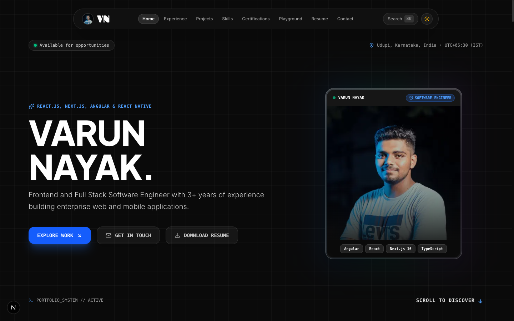
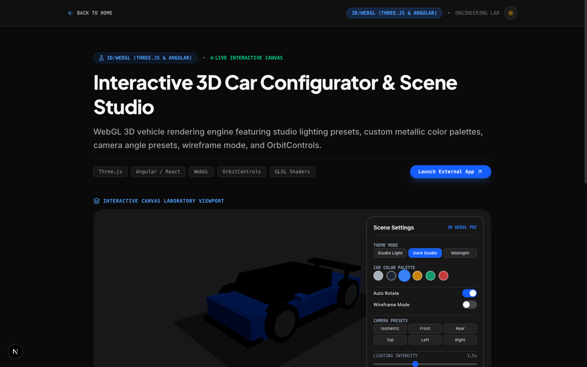
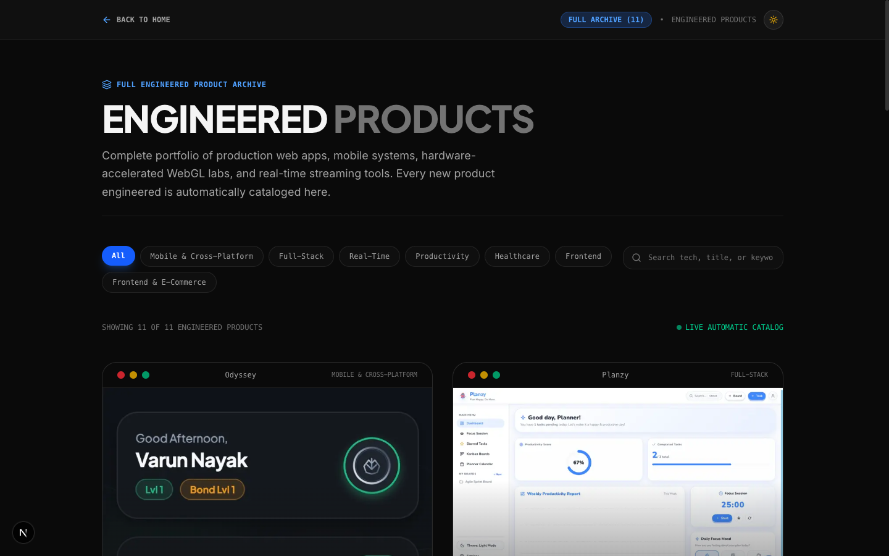
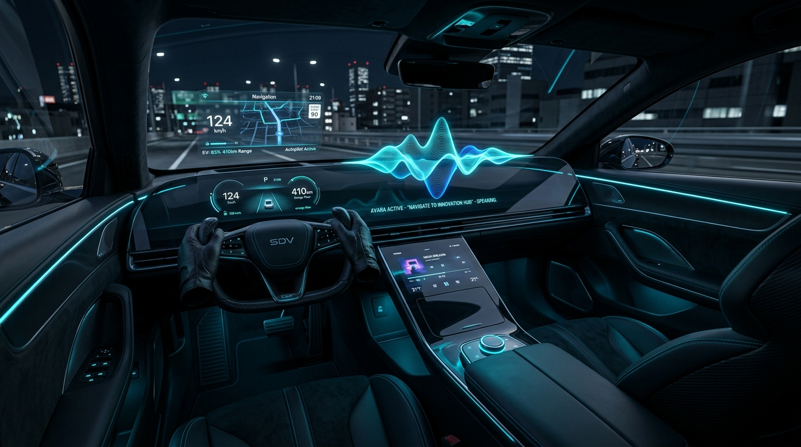

# 🚀 Varun Nayak — Senior Software Engineer Portfolio

A state-of-the-art, high-performance developer portfolio built with **Next.js 16 (App Router)**, **React 19**, **Three.js / WebGL**, **Framer Motion**, and **Tailwind CSS**.

Designed and engineered by **Varun Nayak**, Senior Software Engineer specializing in Autonomous Systems, Software-Defined Vehicles (SDVs), WebGL/3D Graphics, and High-Scale Full-Stack Architecture.

---

## 📸 Portfolio Snapshots

### 1. 🌟 Main Hero Section & WebGL Ambient Studio
Interactive hero section with ambient particle canvas, dynamic typography, and primary CTA actions.

---

### 2. 🏎️ Interactive 3D WebGL Studio & Laboratory
3D WebGL laboratory featuring an interactive sports car configurator with real-time lighting, color selection, wireframe mode, and camera controls.

---

### 3. 🛠️ Featured Engineering Projects Showcase Grid
Comprehensive engineering showcase grid featuring real-time applications, WebGL games, and platform architectures.

---

### 4. 📝 Engineering Deep-Dive Publication
Deep-dive technical article featuring SDV Edge Sensor Fusion & Voice AI Cockpit architecture insights.

---

## 🛠️ Featured Engineering Projects Detail

| Project | Snapshot | Description |
| :--- | :---: | :--- |
| **Convo AI Voice Assistant** |  | Real-time AI voice meeting assistant with automated transcripts, calendar integration, and AI summaries. |
| **Shah-Mat 3D Chess** |  | Real-time multiplayer 3D chess game powered by WebSockets, Three.js WebGL graphics, and move analysis. |
| **RCB 2025 Fan Experience** |  | High-traffic sports franchise web app featuring dynamic Bento grids, live match scores, and fan interactions. |
| **Nike Store E-Commerce** |  | Modern e-commerce web application with interactive product customization, smooth animations, and cart management. |

---

## 🛠️ Tech Stack & Engineering Standards

### Core Web Technologies
- **Framework**: Next.js 16 (Turbopack, App Router, React Server Components)
- **Language**: TypeScript 5.0 (Strict mode)
- **Styling**: Vanilla CSS Modules & Tailwind CSS (Custom Dark Studio Design Tokens)
- **3D Graphics & Canvas**: Three.js, `@react-three/fiber`, `@react-three/drei`
- **Animations**: Framer Motion, Lenis Smooth Scroll
- **Icons & Typography**: Lucide React, Google Outfit & JetBrains Mono Fonts

### Production Security & SEO
- **Canonical Routing**: Permanent 308 redirects (`www.varunnayak.in` → `varunnayak.in`)
- **Security Headers**: Content-Security-Policy (CSP), HSTS (63,072,000s), X-Frame-Options (DENY), X-Content-Type-Options (nosniff), Referrer-Policy
- **SEO & Metadata**: JSON-LD Structured Data (`Person` & `WebSite`), OpenGraph 1200x630 social images, Dynamic XML Sitemap, `robots.txt`
- **Accessibility**: WCAG 2.1 AA compliant keyboard navigation, ARIA semantics, focus traps, and reduced-motion detection
